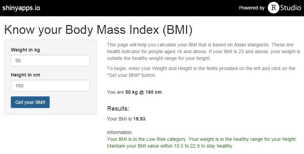

## Introduction

This is a Developing Data Products course assignment that is fulfilled by a Body Mass Index (BMI) calculator deveoped using the Shiny application.

The user will only have to submit their Weight and Height and the BMI calculator will automatically calculate their BMI. Depending on the BMI, its diagnosic and associated risk and recommendations will be displayed.

--- .class #id 

## What is BMI

The BMI is a simple and the most commonly used index used to classify overweight and obesity. It is defined as a persons weight in kilograms divided by the square of his height in meters (kg/m^2).

The World Health Organization (WHO) defines overweight as a BMI of >= 25 and a BMI of >= 30 for obesity. However, because at any given BMI, Asians, generally have a higher percentage of body fat than do Caucasians, the BMI cut- off levels for Asians have been revised such that a BMI 23 kg/m^2 or higher marks a moderate increase in risk while a BMI 27.5 kg/m^2 or more represents high risk for diabetes and cardiovascular diseases.

Below shows the various categories according to the BMI of an asian adult:

<li>BMI <18.50 : Underweight, Risk of nutritional deficiency diseases and osteoporosis
<li>BMI [18.50 - 22.99] : Normal range,Low health risk
<li>BMI [23.00 - 27.40] : Overweight, Moderate health Risk
<li>BMI >=27.50 : Obese, High health Risk

--- .class #id 

## How is BMI calculated?

By using the following formula:

BMI = weight(kilograms) / height(metres)^2

Here is an example of how BMI is caluclated.

```r
weight = 75
height = 1.8
BMI <- weight/height^2

BMI
```

```
## [1] 23.14815
```

--- .class #id 

## Screenshot of the BMI calculator

Here is a screenshot of how the BMI calcualtor looks like.



The BMI calculator can be accessed from the Shiny server via https://minksm.shinyapps.io/BMICalculator

--- .class #id 
